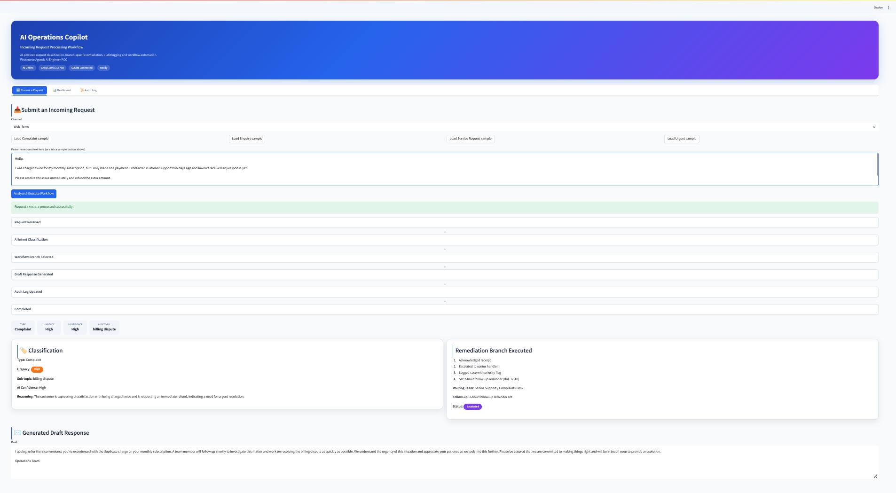
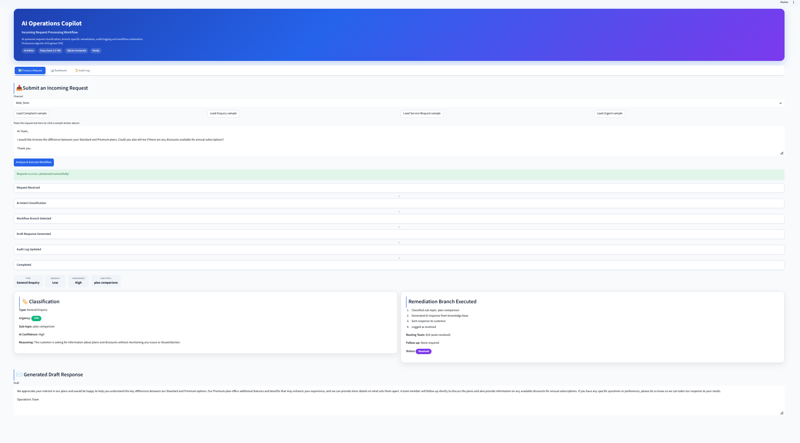
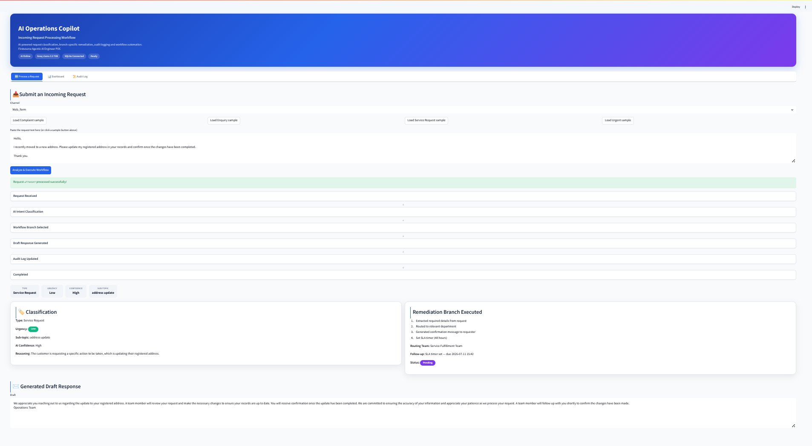
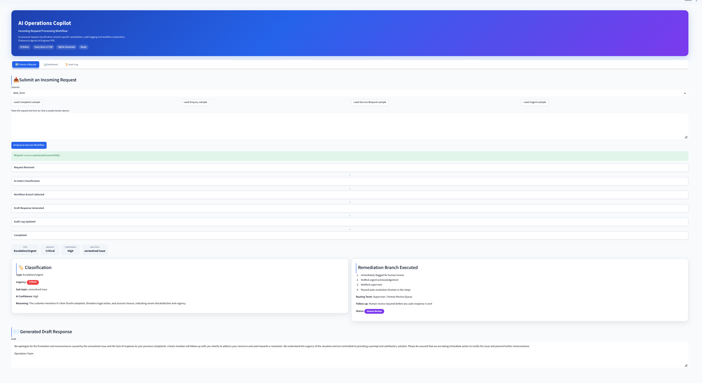
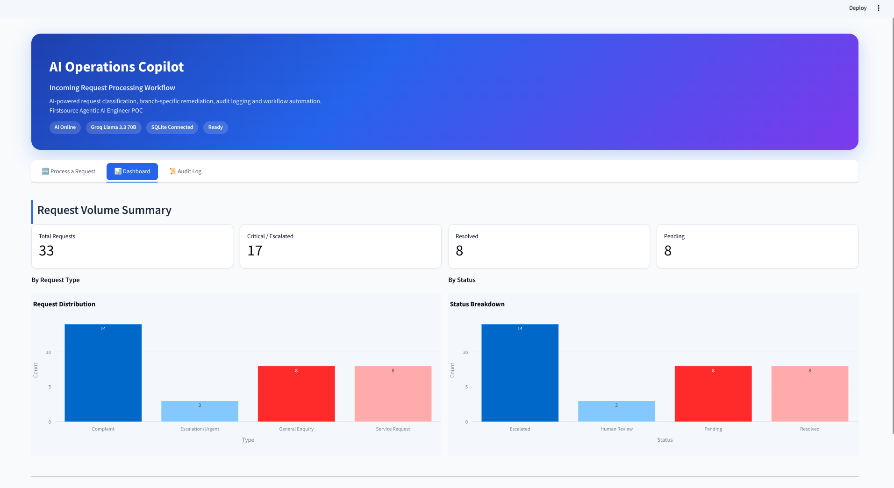
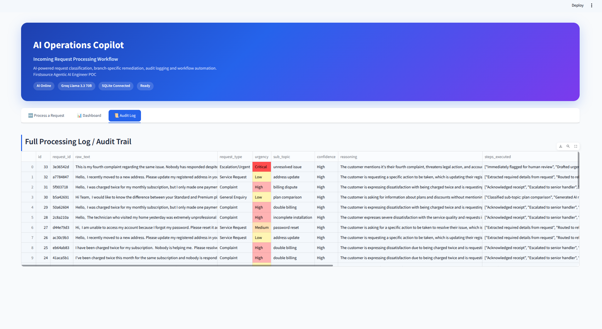

# Incoming Request Processing Workflow

An AI-powered prototype that receives, classifies, and executes a branch-specific remediation workflow for incoming customer requests — built as a proof-of-concept for an operations team handling complaints, enquiries, service requests, and escalations.

**Live demo:** _[add your Streamlit Cloud link here after deploying]_
**Repo:** _[add your GitHub link here]_

---

## 1. Problem Understanding

Operations teams currently read every incoming request manually, decide what type it is, and figure out what to do next — a process that is slow and inconsistent across handlers. This prototype automates that first mile: it classifies each request using an LLM and then runs a **type-specific, multi-step remediation workflow** rather than a single generic response, so the output an operator sees already looks like a resolved (or properly escalated) case.

---

## 2. Solution Architecture

```
Incoming request (text)
        │
        ▼
 Groq LLM Classifier  ──►  ClassificationResult
 (llama-3.3-70b)            { type, urgency, sub_topic, confidence, reasoning }
        │
        ▼
 Remediation Engine (BRANCH_MAP dispatch)
   ├── Complaint          → escalate + 2hr follow-up
   ├── General Enquiry    → auto-resolve with AI response
   ├── Service Request    → route to department + SLA timer
   └── Escalation/Urgent  → human review + pause auto-resolution
        │
        ▼
 SQLite case_log (audit trail)
        │
        ▼
 Streamlit UI (Process tab / Dashboard / Audit Log)
```

The core design decision was to keep **classification** and **remediation** as two separate, independently testable modules. The LLM only ever does classification — it never decides the workflow steps itself. That keeps the branching logic deterministic and auditable, which matters more for an operations tool than for a generic chatbot.

---

## 3. Classification Logic

The classifier (`backend/classifier.py`) sends the raw request text to Groq's `llama-3.3-70b-versatile` model with a system prompt that forces one of exactly four categories, plus an urgency level. Two implementation choices worth calling out:

- **`response_format={"type": "json_object"}`** — forces structured JSON output instead of free text, so the result can be parsed reliably every time rather than regex-matched out of prose.
- **`temperature=0.2`** — classification should be consistent, not creative, so temperature is kept low.
- **Fallback on API failure** — if the Groq call throws (bad key, rate limit, network issue), the request is not dropped or crashed on; it's routed to `Escalation/Urgent` / human review as a safe default, since sending an unclassified request straight to auto-resolution would be worse than over-escalating it.

| Request Type | Urgency | Trigger examples |
|---|---|---|
| Complaint | High | Dissatisfaction, billing errors, repeated issues |
| General Enquiry | Low | Information requests, no issue to resolve |
| Service Request | Medium | Account changes, address updates, installs |
| Escalation/Urgent | Critical | Legal threats, repeated unresolved complaints, safety concerns |

---

## 4. Remediation Strategy per Branch

Each branch (`backend/remediation_engine.py`) runs at least two downstream steps and produces a distinct output shape:

**Complaint** → Acknowledge → Escalate to senior handler → Log with priority flag → Set 2-hour follow-up. *Rationale: a dissatisfied customer needs a human in the loop quickly, not a bot reply.*

**General Enquiry** → Classify sub-topic → Generate AI response from knowledge base → Send → Log as resolved. *Rationale: lowest risk branch, safe to fully auto-resolve.*

**Service Request** → Extract details → Route to department → Generate confirmation → Set 48hr SLA timer. *Rationale: needs a real department action, so it gets an SLA timer instead of a follow-up reminder.*

**Escalation/Urgent** → Flag for human review → Draft urgent acknowledgement → Notify supervisor → Pause auto-resolution. *Rationale: the one branch that deliberately never lets the system resolve on its own.*

---

## 5. End-to-End Example per Branch

**Complaint**
Input: *"I've been charged twice this month for the same subscription and nobody is responding to my emails."*
Output: Type=Complaint, Urgency=High → escalated to Senior Support / Complaints Desk, 2hr follow-up reminder set, empathetic draft acknowledgement generated, status: `Escalated`.

**General Enquiry**
Input: *"Hi, can you tell me what payment methods you accept and if you support international cards?"*
Output: Type=General Enquiry, Urgency=Low → auto-resolved, AI-generated informational response sent, status: `Resolved`.

**Service Request**
Input: *"I recently moved to a new address and need my billing address updated on my account."*
Output: Type=Service Request, Urgency=Medium → routed to Service Fulfillment Team, 48hr SLA timer set, confirmation message drafted, status: `Pending`.

**Escalation/Urgent**
Input: *"This is the THIRD time I'm complaining about the same billing error. If this isn't fixed today I will be cancelling my contract and contacting my lawyer."*
Output: Type=Escalation/Urgent, Urgency=Critical → flagged for human review, supervisor notified, auto-resolution paused, status: `Human Review`.

Sample input files for all four are in `docs/sample_requests/`; corresponding output screenshots are in `docs/screenshots/`.

### Screenshots

**Complaint**


**General Enquiry**


**Service Request**


**Escalation/Urgent**


**Dashboard**


**Audit Log**


---

## 6. Tools Used

| Component | Tool |
|---|---|
| Classification LLM | Groq API (Llama 3.3 70B, free tier) |
| Frontend | Streamlit |
| Backend logic | Python (dataclasses, dict-based branch dispatch) |
| Case log / audit trail | SQLite |
| Deployment | Streamlit Community Cloud |

Groq was chosen over paid APIs specifically because the assignment asked for free-resource tools — it gives fast inference on an open-weight model with no cost.

---

## 7. Folder Structure

```
incoming-request-processing-workflow-firstsource/
├── backend/
│   ├── models.py              # data structures (IncomingRequest, ClassificationResult, RemediationOutput)
│   ├── classifier.py          # Groq LLM classification
│   ├── remediation_engine.py  # branching logic for the 4 request types
│   └── database.py            # SQLite case log / audit trail
├── frontend/
│   └── app.py                 # Streamlit UI — intake form, dashboard, audit log
├── docs/
│   ├── sample_requests/       # one sample input per branch
│   └── screenshots/           # output screenshots per branch + dashboard + audit log
├── requirements.txt
├── .env.example
└── .gitignore
```

---

## 8. Setup Instructions

```bash
git clone <repo-url>
cd incoming-request-processing-workflow-firstsource
python3 -m venv venv
source venv/bin/activate
pip install -r requirements.txt
```

Create a `.env` file in the project root:
```
GROQ_API_KEY=your_free_groq_api_key
```
(Get a free key at https://console.groq.com — no credit card required.)

Run the app:
```bash
streamlit run frontend/app.py
```

---

## 9. Optional Enhancements Implemented

- **Audit trail** — every processed request is logged to SQLite with full classification + remediation detail, visible in the Audit Log tab, color-coded by urgency.
- **Summary dashboard** — request volume by type and by status, plus quick metric cards (total, escalated, resolved, pending).

## 10. Future Enhancements (if given more time)

- Generate draft responses via LLM per-request instead of templated text, for more natural tone variation.
- Batch upload of multiple requests from a CSV/inbox export.
- Confidence-based human-override queue for classifications below a threshold.
- Slack/email integration for real routing notifications instead of on-screen text.